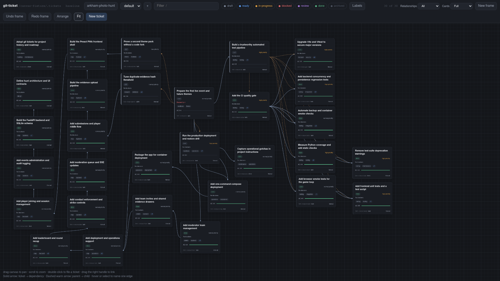
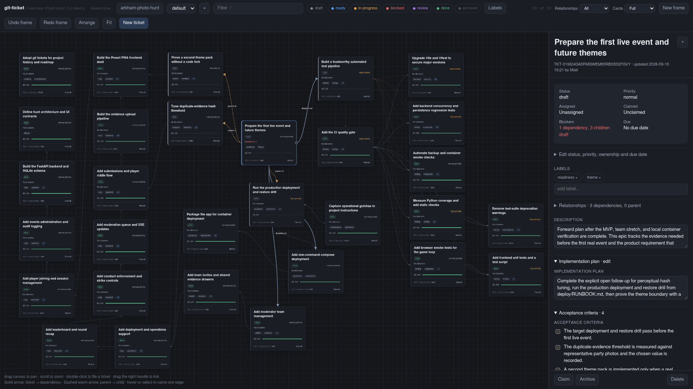
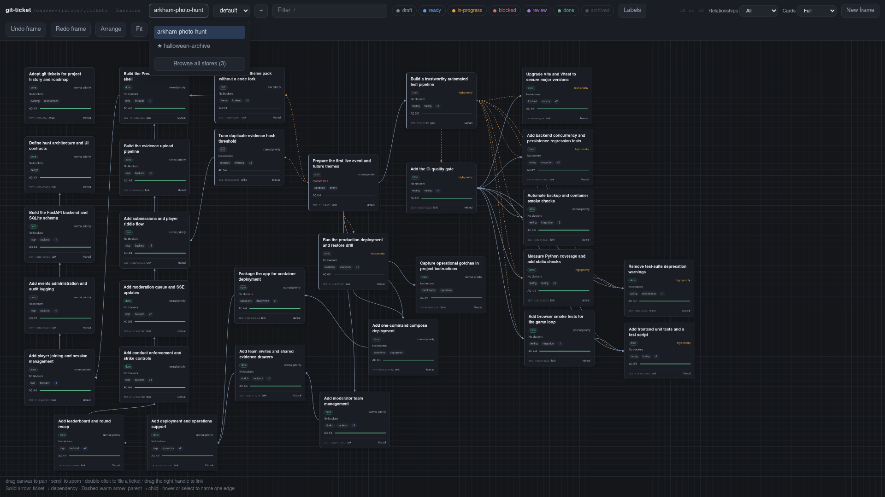

# git-ticket-canvas

An infinite canvas over one or more [git-ticket](https://github.com/terva-sh/git-ticket)
stores. A Go binary serves the Preact frontend and HTTP API. The frontend uses
TypeScript and Vite; its built assets are committed in `web/dist` and embedded
in the binary. No Node process or database is required at runtime.

There are two commands. `git-ticket-canvas` is the canvas on your own machine:
loopback, writable, no authentication, and it refuses an address anybody else
could reach. `git-ticket-canvas-server` is the canvas published at a hostname:
it refuses to start without an OpenID Connect provider, defaults to read-only,
and grants read access per store. Which one is running is answerable from its
name rather than from the flags it was given.



Selecting a card opens the inspector: every field, acceptance criteria,
definition of done, notes, comments, claim and archive, edited in place against
the same library mutations the CLI uses.



One canvas can serve several stores. The picker shows the open store, favorites,
and the way into the full list; a store that cannot be opened is listed with the
reason rather than hidden.



These three images are generated from a committed ticket-store archive by
`just readme-shots`, so they can be regenerated whenever the canvas changes.
See [README images](docs/readme-images.md).

## Build and run

From a source checkout, build with Go using the committed frontend assets.
No JavaScript toolchain is needed for this build:

```sh
go build -o git-ticket-canvas .
go build -o git-ticket-canvas-server ./cmd/git-ticket-canvas-server
./git-ticket-canvas -store /path/to/repo
```

Open http://127.0.0.1:7777. The repository must already contain a `.tickets`
store; initialize one with `git ticket init` if needed. With no `-store`, the
canvas looks for a store at or above the current directory. Writes are recorded
as the store's configured actor; pass `-actor human:your-id` to record them as
somebody else, or `-read-only` to refuse every write, including card placement.
The application writes ticket and layout files but never commits or pushes them.

Use `-h` for the full flag list, `--version` for build provenance, or
`--version --json` for machine-readable output. `git-ticket-canvas` refuses a
non-loopback `-addr`, because it has no authentication and the address it binds
is the whole of its access control. To serve other people, run
`git-ticket-canvas-server`: it needs an OpenID Connect provider, grants read
access per store, and keeps a store nobody granted invisible rather than
public. See [serving a canvas](docs/serving-a-canvas.md).

With Go, Node.js 22.12 or newer, npm, and just installed, rebuild and install
from source:

```sh
just web-setup
just install
# Once git-ticket-canvas is on PATH:
git ticket-canvas -store /path/to/repo
```

`just install` rebuilds the frontend and installs both commands into the first
writable of `~/.local/bin` or `~/bin`. Use `just install /path/to/bin` for an
explicit destination. See [local installation](docs/local-install.md) for
details. Git discovers the executable as `git ticket-canvas`, not
`git ticket canvas`.

See [release usage](README-release.md) for archive installation and container
serving, and the [release runbook](docs/releasing.md) for publication checks.

## Serve several stores

Every way of naming a store is repeatable, and they combine:

```sh
git-ticket-canvas -store /ws/ledger -store canvas=/ws/git-ticket-canvas
git-ticket-canvas -root /ws -R=3 -exclude node_modules
git-ticket-canvas -config ~/.config/git-ticket-canvas.yml
GIT_TICKET_CANVAS_STORES=ledger=/ws/ledger git-ticket-canvas
git-ticket-canvas -root /ws -scan
```

`-store` takes a path or `NAME=PATH`. `-root` names a directory to search, and
`-R` turns the search on, with an optional depth as `-R=N` or as a separate
`-depth N`, and 4 as the default. `-exclude` keeps a name, path, or pattern out
of the walk. `-config` names a YAML file with `stores`, `roots`, `exclude`, and
for the served canvas `identity` and `roles`. A flag wins over the environment
variable, and the environment variable wins over the file. `-scan` prints what
discovery decided about every candidate and exits, which is how to find out why
a repository is missing before starting a server.

A store's id is the directory name that holds it, followed by twelve
hexadecimal characters of the SHA-256 of its resolved path, as
`ledger-3f0c9a1b2d4e`. The id is what the URL fragment carries, as
`#store=ledger-3f0c9a1b2d4e`, and what the per-store API routes are keyed on. It
does not move when another store is added, when `-root` changes, or when two
paths reach one store through a symbolic link. A store named as `NAME=PATH` or
in the configuration file uses that name as its id instead. The display name a
person sees defaults to the directory name and is not unique.

The **Stores** button in the toolbar opens the picker: the open store, the
starred favorites, and a way into the browser, which lists every store grouped
by the root it was found under, with a search box and a **Search the configured
roots again** control. A store that cannot be opened is listed with the reason.
Starring a store keeps it near the top of the picker, and the store you had open
last is the one that opens next time.

Favorites and the last store are kept outside every repository, in
`state.json` under the canvas state directory: `$XDG_STATE_HOME/git-ticket-canvas`
or `~/.local/state/git-ticket-canvas` on Linux, `~/Library/Application Support/git-ticket-canvas`
on macOS, and `%LOCALAPPDATA%\git-ticket-canvas` on Windows. `-state` names the
file explicitly. A served canvas keeps `actors.json` and `people.json` beside it.

A store costs a file watcher only once somebody looks at it. `-max-active`
bounds how many are open at once, 8 by default, and `-store-idle` closes one
nobody is watching after fifteen minutes. Both matter on a workspace of twenty
repositories, where inotify instances are a budget shared with every editor on
the machine.

## Frontend development

```sh
just web-setup          # Install locked dependencies with npm ci.
just build              # Typecheck, build web/dist with Vite, then build Go.
just web-typecheck
just web-test           # Platform, component, and import-boundary tests.
```

For live frontend development, run these in separate terminals:

```sh
just api-dev -store /path/to/repo -read-only
just web-dev
```

Open http://127.0.0.1:5173. Vite serves the Preact source and proxies `/api` to
Go on port 7777. The Go port serves the last built `web/dist`, not Vite's source.
Set `GIT_TICKET_CANVAS_API_URL` to a loopback HTTP origin if the API uses another
port.

Commit frontend source, lockfile changes, and regenerated `web/dist` together.
Raw `go build` does not rebuild the frontend. Before release, `just parity-check`
verifies the committed bundle before any rebuild, runs frontend and Go checks,
tests embedded browser behavior, and builds a clean checkout without Node.
Browser checks require Playwright Chromium; install it with `just browser-setup`.
See [the parity gate](docs/development-preact.md#development-checks-and-the-release-gate)
for full validation prerequisites and
[the Preact migration](docs/preact-migration.md) for verification evidence.

## What this is for

A proof of concept for managing work spatially rather than in lanes, and a
probe into what the eventual git-ticket web interface should be. Everything
below is a position it takes, not a detail it happens to have.

## The one design question, and the answer

A canvas knows exactly one thing a ticket file does not: **where the card
sits.** Everything else here is a projection of the store.

Position is *authored* data, not derived data. Spatial memory is the whole
reason a canvas beats a list — "the thing I keep avoiding is bottom-left" is
real information — so an arrangement has to survive a cache rebuild the same
way a ticket survives one. That rules out keeping it only in an application
database.

It also rules out a binary database *in the repository*. git-ticket's format is
per-field mergeable text with a merge driver; a SQLite page would be the one
file in the store that two worktrees could not reconcile. Two people dragging
different cards is the ordinary case, not the exotic one.

So a board is text, one line per card or frame, sorted by ID:

```yaml
# .tickets/canvas/default.yml
schema: 3
board: "default"
cards:
  "TKT-01M23FCNEN7TRTAXZCD9388946": {x: 0, y: -280}
  "TKT-01M23FCZKB8XEHFF0YEMD36K3M": {x: 0, y: -40}
```

Frames, when a board has any, follow under `frames:` in the same shape, one
line each with title, bounds, color, and members. Pens and the inbox pin, when
authored, follow under `pens:`, `ruleOrder:`, and `inbox:`.

Verified, not asserted: one drag produces a one-line diff, and two branches
each moving a different card merge with no driver and no conflict.
`internal/layout/layout_test.go` holds that property down.

**The database still belongs in the design — for the other half.** Search
index, viewport and session state, presence, undo history, per-user overlays:
that is derived state, it wants real query support, and it should live in a
gitignored cache rebuilt from disk on boot. Nothing here needs it yet, so
nothing here has it; the split is what matters, and it holds when you add one.
The one piece of per-person state the canvas does keep, favorites and the last
store, lives in the state directory above rather than in any repository.

A useful consequence: the board file contains geometry and nothing else, so a
repo can `.gitignore` `.tickets/canvas/` and lose only arrangement. Shared
boards and private boards are the same feature with a different gitignore.

### Pinned vs unpinned

A ticket filed from the CLI has no card. It gets an auto-placed position in
status lanes, drawn with a dashed border, and **that guess is never written**.
Dragging it is what pins it. Otherwise every `git-ticket create` would churn
the layout file and claim a placement nobody chose. Press `u` on a selection to
hand it back to automatic placement, which removes its line from the file.

### Frames

A frame is a titled, colored rectangle with a member list, stored beside the
cards. **New frame** in the toolbar, then draw on empty canvas to capture the
cards whose centers fall inside, or type bounds into the frame panel. Moving a
frame moves its members and pins them. Resizing moves the boundary only.
Membership is edited from the frame membership section of the inspector. Frame edits have their own undo and
redo, and a frame edit is refused when the board changed underneath it rather
than applied to a board you were not looking at.

## Architecture

```
main.go              the desk canvas: one call into internal/cli
cmd/...-server       the served canvas: the same, with the other Kind
internal/cli         flags, refusals, store discovery, actor resolution, serving
internal/config      the store list: config file, GIT_TICKET_CANVAS_STORES, -store
internal/discover    walking a directory tree for stores, bounded by depth
internal/state       favorites and last store per user, outside every repository
internal/auth        the relying party, server-side sessions, the login guard
internal/grants      which roles an identity holds on a named resource
internal/actors      which signed-in subject writes under which actor id
internal/people      who has signed in, built as a side effect of logging in
internal/layout      the board file: cards, frames, routing; read, write, render
internal/api         one Server per store, a Registry over them, the watcher, DTOs
internal/buildinfo   version, commit, and modified state for --version and /api/version
internal/testpath    absolute paths for tests that must name one, portably
web/src/main.ts      Preact entry point
web/src/ui           App, Canvas, inspector, composer, toolbar, store picker, frames
web/src/platform     typed HTTP client, ticket state, live updates, geometry, pens
web/dist             committed Vite output, served from go:embed
web/assets.go        the go:embed of web/dist, shared by both commands
```

Preact owns the browser UI. `App` owns accepted store snapshots, selection,
and forms; `Canvas` owns viewport state, gestures, animation frames, and
pending layout previews. The platform modules contain no Preact or DOM imports.
See [component ownership and save policies](docs/preact-canvas.md).

The Go server uses the library directly (`ticket.Store`), not through shell
commands. Every ticket edit goes through the typed `Mutation` set under the
store lock with the same revision preconditions the CLI uses. The browser
accepts ticket changes only after the server confirms them. Card movement uses
local previews while layout saves are pending; failed saves do not become
accepted layout state.

Each store has its own `Server`: one store, one layout writer, one file
watcher, one actor, one mutation lock. The `Registry` routes by store id and
opens a store the first time somebody asks for it. Nothing is shared between
stores, so a write to one cannot change another's ETag or wake its watcher.

### Live updates

The server watches each open store with fsnotify. Events settle for 100ms, with
a one-second cap during continuous writes, and a safety scan every minute
repairs anything a notification missed. Every change bumps a generation, and
`GET /api/stores/{store}/events` streams `{epoch, generation, scopes, stale,
degraded}` to each browser as server-sent events.

The browser never applies a notification. It answers one with a conditional
`GET .../board` carrying `If-None-Match`, and a 304 costs nothing. While the
stream is down it polls every 12 seconds and reconnects with backoff; while the
stream is live it still reads once a minute as a safety net, and once more
whenever the tab becomes visible. So a terminal or an agent editing the same
files shows up within a second, and a missed event costs at most a minute.

### API

Every per-store route lives under `/api/stores/{store}/`, where `{store}` is
the id described above. The same routes answer unprefixed at `/api/` only when
the canvas serves exactly one store; with more, an unprefixed request gets
`store_required` and 404. A store this caller may not read answers exactly as
one that is not configured.

| | |
|---|---|
| `GET /api/stores` | every store: id, display name, path, available, active, favorite, read-only, reason |
| `POST /api/stores/rescan` | search the configured roots again; refused with `rescan_unavailable` on the served canvas |
| `GET` and `PUT /api/favorites` | the caller's starred stores and last store; `PUT {store, favorite}` |
| `GET /api/session` | whether anybody is signed in, and as whom; `authenticated: false` on the desk canvas |
| `GET /api/version` | the same provenance as `--version --json` |
| `GET /api/stores/{store}/board?board=` | tickets (all statuses), layout, vocabulary, and readiness in one read, with an `ETag` |
| `GET /api/stores/{store}/schema` | statuses, types, priorities, labels, milestones, permitted transitions, which transitions need a reason |
| `GET /api/stores/{store}/events` | server-sent invalidations, above |
| `POST /api/stores/{store}/tickets` | create; optional `card` places it in the same call |
| `PATCH /api/stores/{store}/tickets/{id}` | `{ifRevision, ops:[…]}` |
| `DELETE /api/stores/{store}/tickets/{id}` | `?ifRevision=&force=` |
| `PUT /api/stores/{store}/layout` | `{board, cards:{id:{x,y}|null}, frames?, routing?, expect?}` |

The served canvas adds `GET` and `PUT /api/stores/{store}/actor` for the actor
a signed-in person writes as, `GET` and `PUT /api/actor` as their single-store
forms, and `GET /api/people` for administrators.

Ops are named and closed — `setStatus`, `addDependency`, `setChecklistItem`,
`appendNote`, `claim`, `archive`, and so on — each mapping to exactly one
library mutation. There is deliberately no "replace the whole ticket" op, for
the same reason the library does not offer one: it would silently drop the
frontmatter keys a newer reader wrote, and the format's forward compatibility
rests on never doing that.

Two details worth keeping in whatever you build next:

- **Revisions chain through a batch.** The client's `ifRevision` gates the
  first op; each op afterwards carries the revision the previous one produced.
  Sending the client's revision to every op would refuse the second one every
  time; dropping the precondition after the first would let a batch stomp a
  concurrent write halfway through. Chaining is the only reading where "these
  edits apply to the ticket I was looking at" stays true for the whole batch.
- **`stale_revision` reloads rather than retries.** Somebody else wrote the
  ticket — the CLI, an agent, another tab. The edit did not happen, and showing
  it as though it had is how a canvas starts lying about a repository.

Error codes map straight onto HTTP: `stale_revision`/`claim_conflict` → 409,
`invalid_transition`/`invalid_field` → 422, `ticket_not_found` → 404,
`unknown_store` → 404, `store_unavailable` → 503 with `Retry-After`. The
client never re-derives a rule the library owns; it asks `/api/schema` which
transitions need a reason and prompts for one.

## Interactions

| | |
|---|---|
| drag background | pan · scroll to zoom at cursor |
| drag card | move (shift-click to select several; they move together); pins it |
| drag right handle onto another card | that card now waits on this one |
| double-click empty canvas | file a draft there |
| click card | inspector: every field, AC/DoD, notes, comments, claim, archive, frame |
| `/` `n` `f` `u` `Esc` | filter · new · fit · release to automatic · close or cancel |
| `Del` or `Backspace` | delete the selected ticket, after confirmation |

The toolbar also switches boards and creates one, filters by text, status
chips, and label chips with a match mode, chooses which relationships to draw
and how dense the cards are, creates frames, lays every unpinned card out in
status lanes with **Arrange**, and zooms or fits.

Solid arrows are dependencies (gating), faint dashed lines are parent edges
(grouping) — different meanings, so an epic never looks like a blocker.

## Known edges

- The board payload sends every ticket with full body. Fine at a few hundred;
  the seam for splitting card-level fields from detail is the `/api/board` DTO.
- `git-ticket-canvas` has no authentication. Keep it and any container port
  mapping on loopback.
- `git-ticket-canvas-server` defaults to read-only, and no grant confers a
  writer role yet, so nothing distinguishes a reader from a writer. Turning
  `-read-only` off would let every person who can read a store write to it
  under the actor they chose. Leave it on. Its sessions do not survive a
  restart, rescanning is refused, and there is no administration interface
  yet.
- The layout schema carries `w` and `collapsed` on a card, and the API accepts
  and preserves them, but no shipped control sets either. `z` is read for
  stacking.
- The layout schema also carries routing: pens with required labels, a rule
  order, and an inbox pin. The API validates them and `web/src/platform/canvas`
  evaluates them, but the shipped canvas does not wire that evaluation into
  placement, so automatic cards still land in status lanes and nothing authors
  a pen. TKT-01M2441T0PTXRFK6VC4FM1PET7 (Route automatic tickets to
  label-matching canvas pens) is where that lands.
- Cross-branch reads (`Filter.CrossBranch`) are not surfaced; the canvas shows
  the working tree.

## PR reviews

See [targeted Terva reviews](docs/pr-reviews.md) for manual requests, authorized
comment commands and interpreting feedback alongside the existing CI checks.
